# COMP2150 - Level Design Document

### Name: Alexander Milton

### Student number: 47159375

## 1. Player Experience

### 1.1. Discovery

The player learns through attempting encounters and making mistakes. Mistakes are not heavily punished for the majority of the level. Often the player is able to find healing nearby if they make a mistake on the first attempt of an encounter. This allows the player to be experimental with their approach to encounters and build up a repertoire of skills to utilize as the difficulty curve increases throughout the level. This only changes before the final encounter where very few-no(depending if the player has already used it to beat earlier sections of the level) health packs are provided. By this time however, the player will have discovered all the elements of the final encounter previously and can use the developed skills to overcome this fight.

#### Initial Encounters

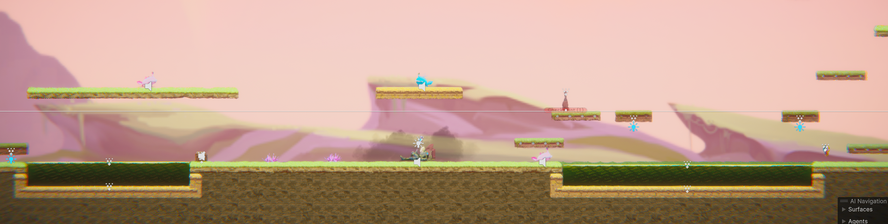

#### Add Complex Platforming then Harder Combat and Simple Platforming

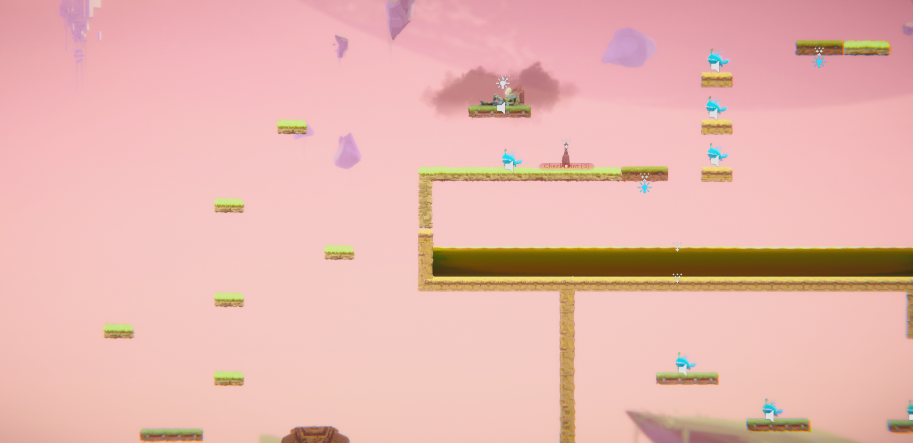

#### Combine Complex Platforming and Combat

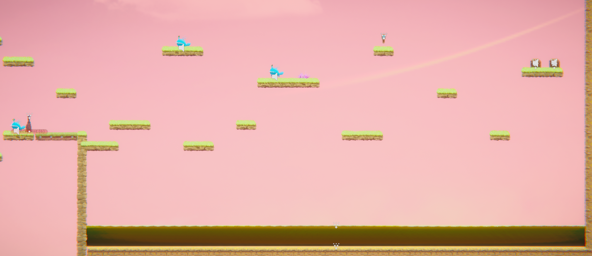

### 1.2. Drama

The intensity curve begins low in section one before increasing into the second section of the map as complex platforming and combat mechanics are combined. The curve continues to build as the player progresses through section 2. Once the player obtains the section 2 key the intensity shifts down significantly into a space of calm where the player can reassess the situation before continuing. Section 3 picks the intensity back up, increasing the number of environmental hazards, making the platforming more claustrophobic, forcing higher precision, and increasing the number of enemies. The intensity ebbs after the player retrieves the section 3 key and returns to section 2. The final gauntlet is now open to the player representing the peak of intensity within this level. it forces a potentially low health player to combat a mixed array of enemies in a small area whilst platforming. When the player passes this encounter the intensity drops significantly and the player is able to calmly approach the finish and win the level.

#### Only One Accessible Health Before Final Encounter

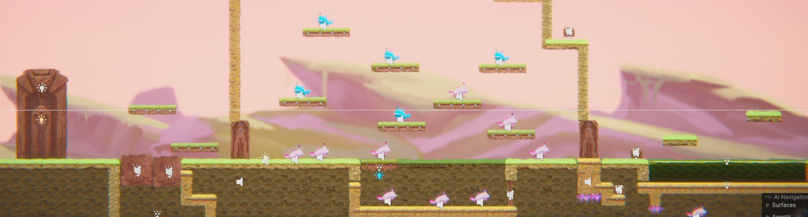

### 1.3. Challenge

The main challenges as they are introduced are:

-   Complex Platforming with limited punishment
     
    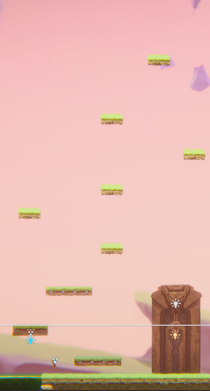
-   Simple Platforming and more complex combat (and new weapon)
     
    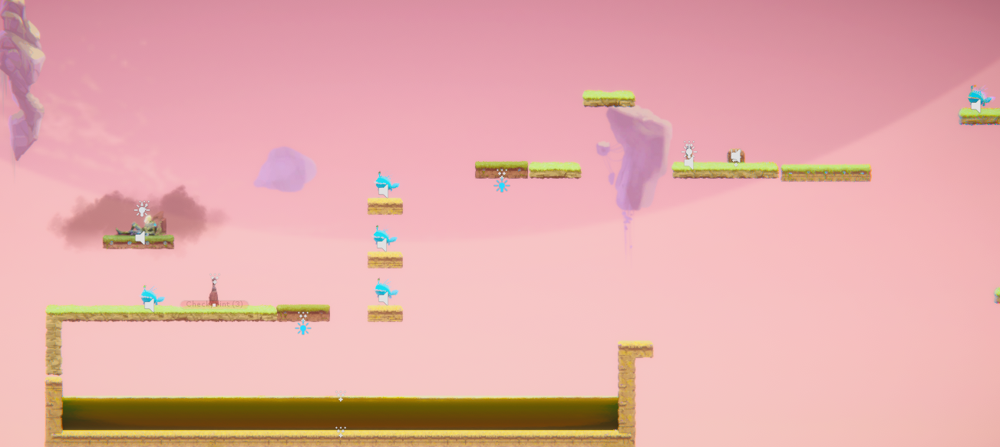
-   Complex Platforming and Combat Combined with Consequence for Platforming Fail
     
    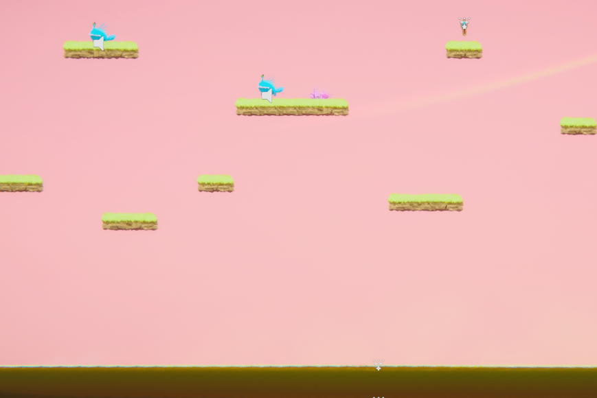
-   Restricted (tight spaces force player to be more precise) Complex Platforming and Intense Combat.
     
    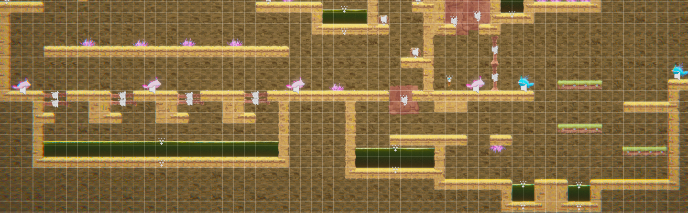
-   Moderate Platforming with ultra high intensity combat
     
    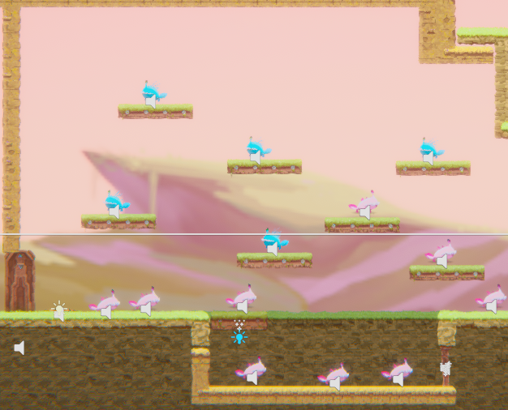

This progression through the different encounters and environment allows the player to build their skills as they go so as to avoid overstraining the player with sudden difficulty spikes whilst preventing boredom by providing a steady increase in the level's difficulty as the player progresses. This prevents the player being forced out of flow through frustration or boredom.

### 1.4. Exploration

Exploration is enabled through the non-linear approach to level design. As displayed in the below diagram there are three main ways of traversing and completing the level. Blue is the most obvious and likely chosen path by individuals, Red provides an increased difficulty spike and largely skips the gun pickup but also can skip the final battle. Yellow is the same path as red except attacking the final battle early before section two. Exploration is further encouraged through small branches within encounters and sections are made either to alert intensity or type of an encounter, or to find pickups like health in places off the beaten path, additionally there is a shortcut route right into the section 3 key room via destructible blocks. In addition to the many paths that players can take there is a distinct difference in look between the sections with section 1 being at ground level, section 2 being up in the clouds, and section 3 being underground, making them all feel like distinct places within the same world.
 
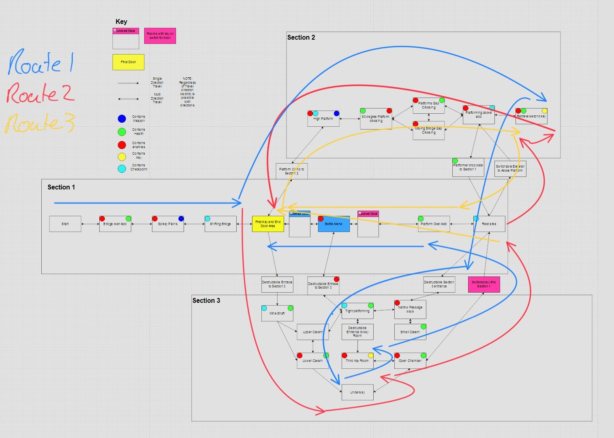

## 2. Core Gameplay

### 2.1. Acid, Vertical Moving Platforms, Chompers, Health Pickups, Spikes

This initial encounter is designed to rapidly but incrementally introduce the basic mechanics of the game, including enemies, environmental hazards, moving platforms, and health pickups. Teaching the player what to avoid, how to avoid it, and how to recover health when they inevitably make a mistake. Generally introducing many mechanics at once can be overwhelming. However, due to the low intensity and linear nature of the encounter the player is able to tackle each part of the encounter in sequence. Effectively producing multiple encounters stacked in very close succession. This therefore provides the benefits of separate encounters whilst removing the need for a long drawn-out intro section with only uni-dimensional encounters.
 
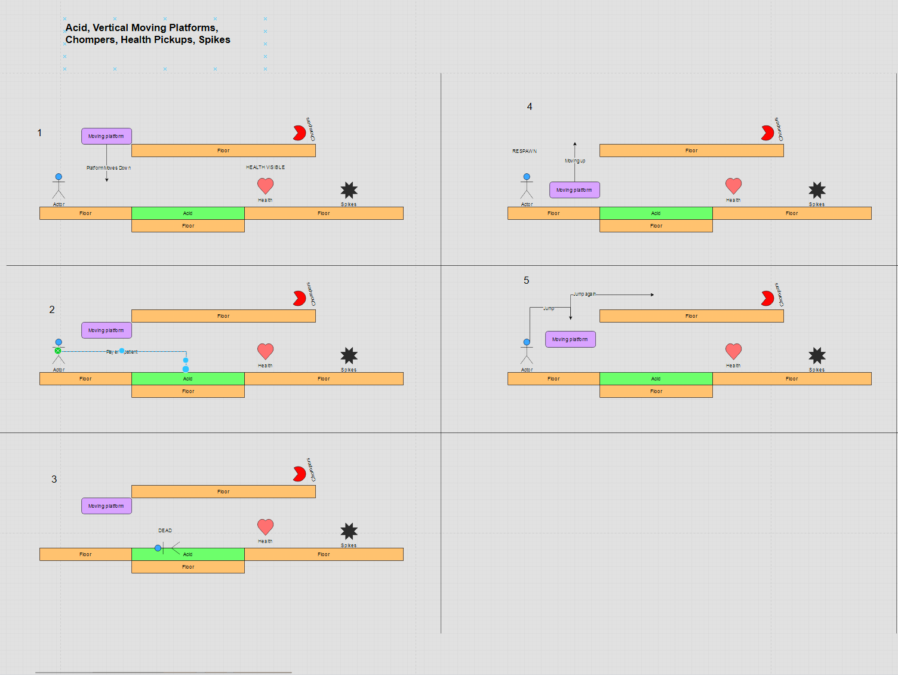 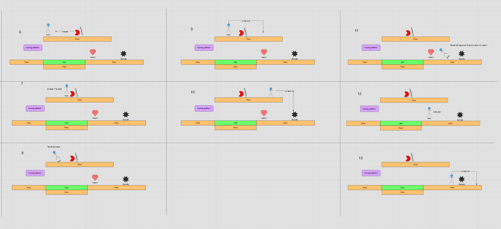

### 2.2. Staff Pickup, Spitters, Pass Through Platform

The second encounter is designed to build off the first introducing additional platforming mechanics, a melee weapon, and a new ranged enemy.Following a similar principle to the first encounter of introducing the player to one mechanic at a time. This encounter increases the intensity by adding a previously encountered enemy and having the mechanics introduced one by one but have them build upon one another i.e. The player meets the spitter then whilst evading the spitter retrieves and uses the staff before utilizing the pass through platform to either escape from or destroy the spitter. This further serves to be manageable but quickly introduces mechanics to the player.
 
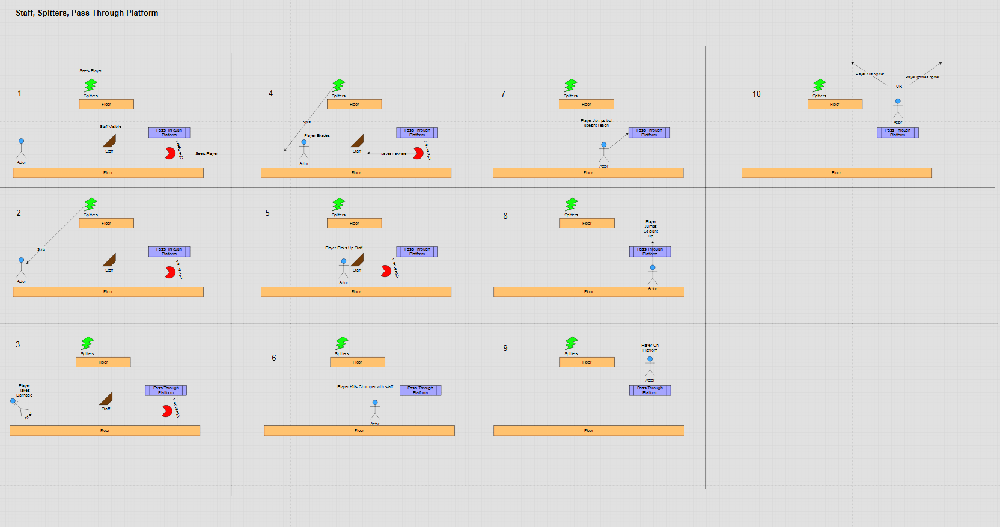

### 2.2. Horizontal Moving Platforms, Checkpoints, Key

After the intensity of the previous encounter this encounter lets the player slow down and take stock of their situation. This encounter is designed to introduce the player to some more complex platforming mechanics, checkpoints, and the final objective of the level. The player is able to experiment and perfect their platforming ability without losing any progress even when they make a mistake due to the introduction of the checkpoint mechanic further reducing the intensity of this encounter. Additionally this encounter introduces the key as the main objective of the level and shows by providing the door in visual range that the two are linked and that more keys are required to open the door and proceed to the next level.
 
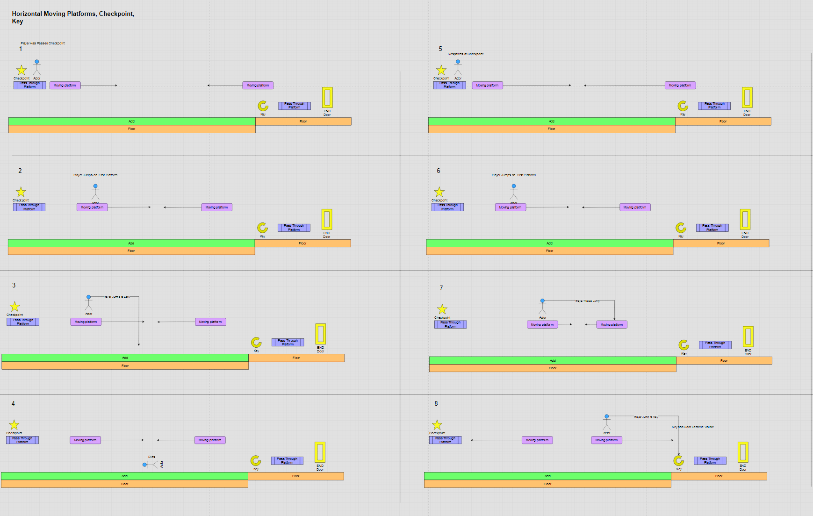 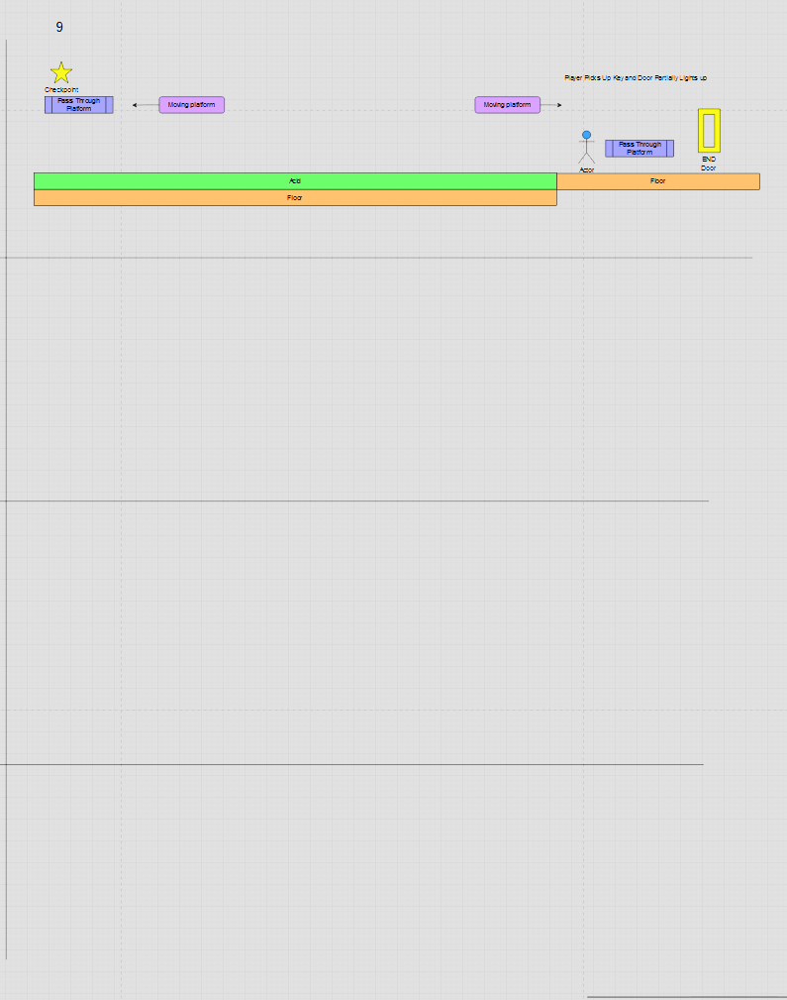

### 2.3. Gun Pickup

The only encounter where only one new mechanic is introduced, this encounter is designed to demonstrate the utility and versatility of the gun weapons use, especially against ranged enemies as well as train the player in the different applications of the weapon.
 
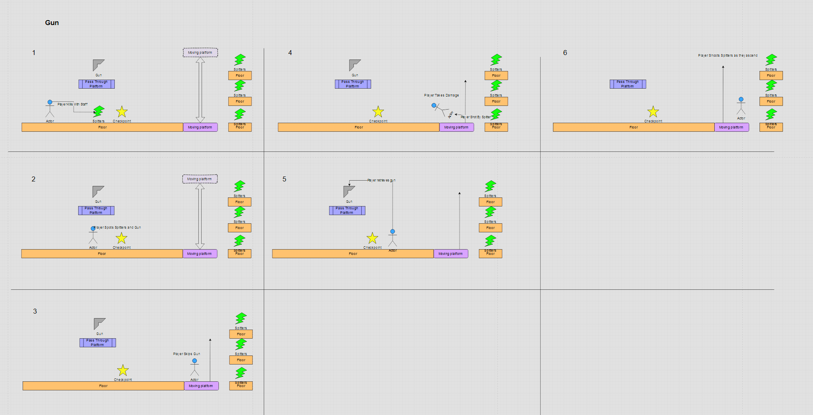

## 3. Spatiotemporal Design

### 3.1. Molecule Diagram

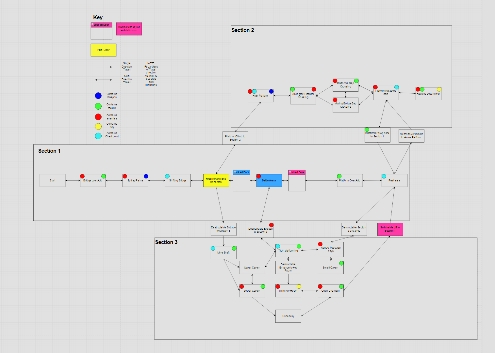

### 3.2. Level Map – Section 1

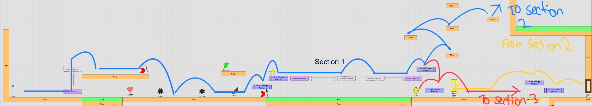

### 3.3. Level Map – Section 2

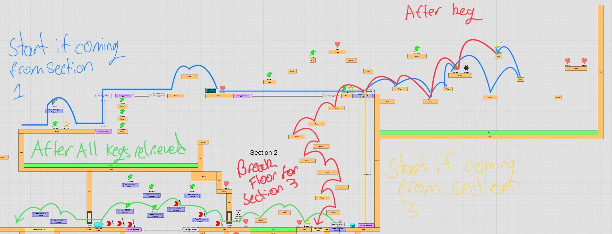

### 3.4. Level Map – Section 3

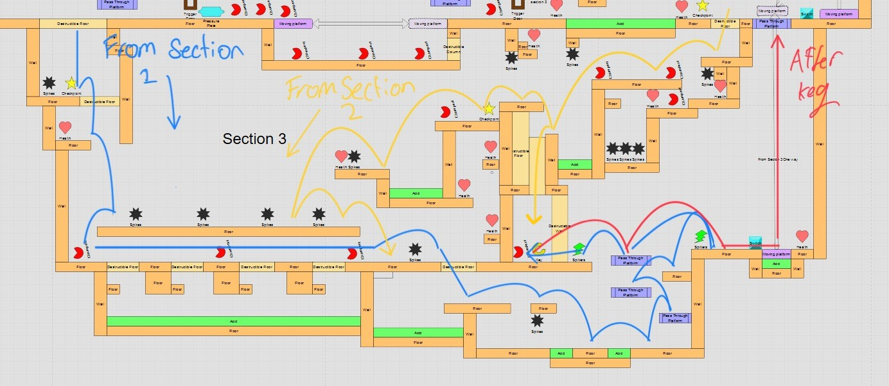

## 4. Iterative Design (~400 words)

### Initial Level Plan

#### Original Level Design

#### Final Level Design

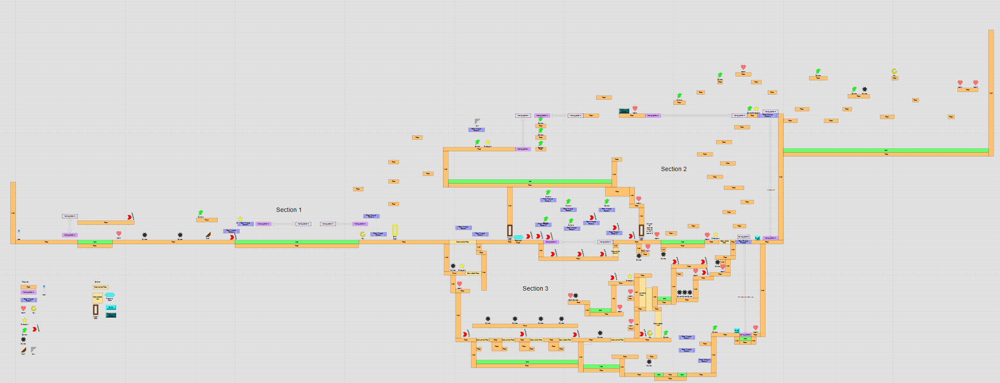

The original design of the level was much simpler and was able to provide a basic outline of how the overall level would be structured and provide inspiration for the aesthetic themes (Clouds, Ground level, Underground) of the different sections. However Upon completing of the level and play testing I found that despite it being able to be completed in a non-linear fashion, it had a number of flaws

-   It was much too short
-   It felt linear, as there were few branching options within sections and little need to explore.
-   It was far too easy in some sections and far too frustratingly unforgiving in others, with certain obstacles or encounters being difficult simply because if you were unlucky you died.

I therefore decided to iterate each section of the level one at a time in order to build specifically upon the themes and specific challenges I wanted to provide for each section whilst increasing their interconnectability and the number of ways a player could approach each section. During this time I also ensured to iteratively build each encounter in order to provide the correct level of intensity and difficulty for each and ensured that when a player died it didn't feel as if it was out of their control, allowing the player to learn from each death.

One area I believe could benefit from further iterative design is final encounter. This encounter is a climatic test of all the skills the player developed and unfortunately whilst it does test the players skills a non-zero portion of the encounter feels like it is luck getting you through it. Additionally I don't think being able to skip this encounter adds to the gameplay so if given further opportunity I remove the ability for the player to circumvent this encounter whilst still providing the multiple level traversal paths currently available.

**Additional Notes:** I did not use any generative AI tools within this assessment.
